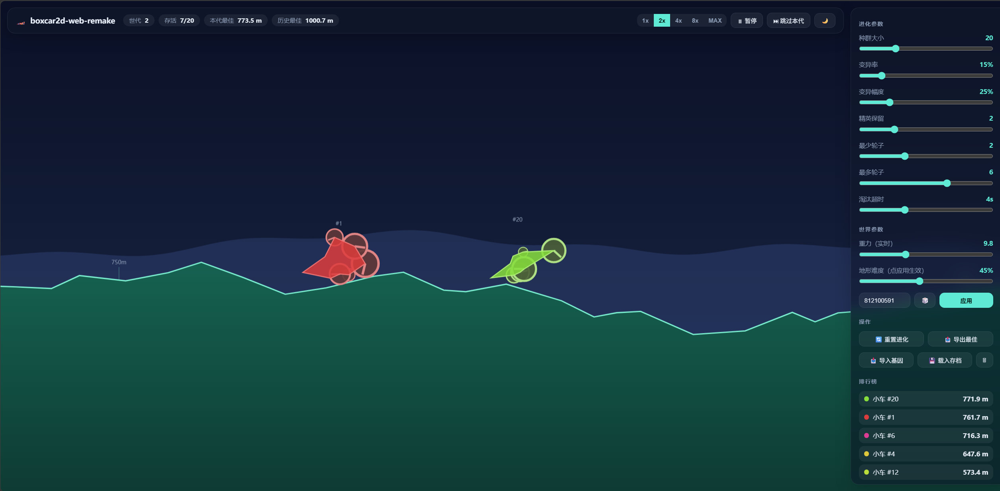

# boxcar2d-web-remake

经典 BOXCAR2D Flash 项目的 Web 复刻版。纯前端实现，使用遗传算法进化小车，并用 planck.js 进行物理模拟。

访问地址：https://firotsilence.github.io/boxcar2d-web-remake/



## 运行

```bash
python3 -m http.server 8080
```

打开 `http://localhost:8080`。

## 发布

推送到 `main` 后，GitHub Actions 会部署到 GitHub Pages。首次发布前，在仓库 `Settings -> Pages` 中选择 `GitHub Actions`。

## 致谢

项目受经典 BOXCAR2D Flash 项目启发，代码与素材为独立实现，和原项目无官方关联。

## 许可证

MIT License。详见 [LICENSE](LICENSE)。
